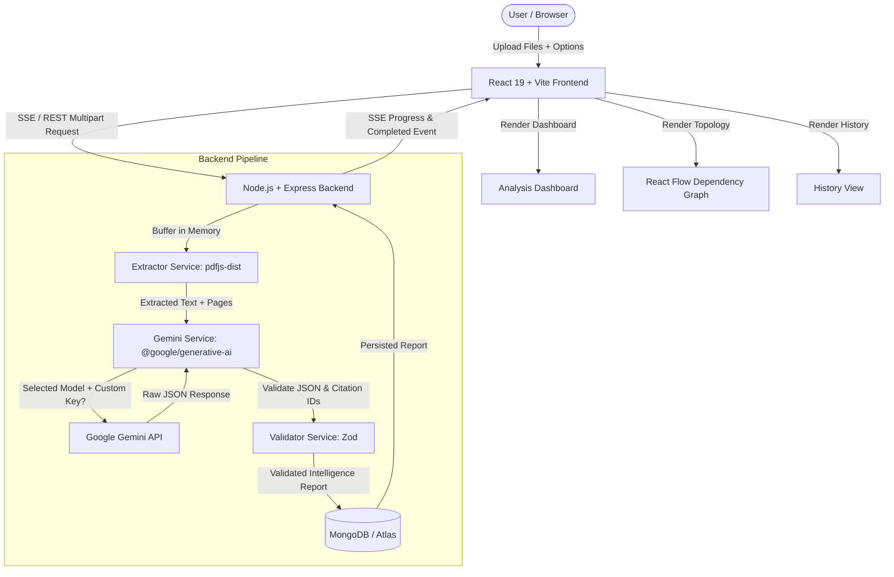
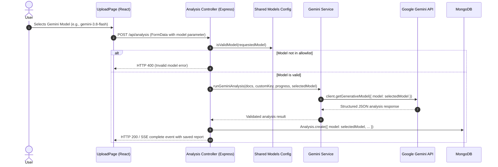

# ContradictionX — AI Requirements Intelligence

> **Detect software requirement conflicts, ambiguities, missing logic, and dependencies before engineering begins.**

[](https://nodejs.org/)
[](https://react.dev/)
[](https://vitejs.dev/)
[](https://expressjs.com/)
[](https://www.mongodb.com/)
[](https://ai.google.dev/)
[](LICENSE)

---

## Overview

**ContradictionX** is a specialized requirements intelligence platform engineered to analyze multiple software specifications, regulatory policies, architecture documents, and product requirements documents (PRDs). By parsing PDF and TXT documents into discrete atomic requirements, ContradictionX uses Google Gemini with strict schema constraints to detect cross-document contradictions, ambiguous phrasing, missing edge-case specifications, and prerequisite dependency chains.

This is **not** a generic PDF summarizer or document chatbot. ContradictionX acts as an automated static analyzer for natural language specifications, producing structured evidence citations, confidence metrics, impact analyses, and actionable harmonization proposals with interactive directed graph visualization.

---

## The Problem

Requirements defects are among the most expensive flaws in software engineering:
- **Fragmented Authoring**: Product managers, security officers, legal counsel, and systems architects author requirements independently at different times.
- **Silent Contradictions**: High-risk logical conflicts frequently pass human review unnoticed (e.g., immediate GDPR right-to-be-forgotten data purging vs. statutory seven-year financial transaction retention).
- **Subjective Ambiguity**: Unverifiable statements such as *"the system must respond quickly under high load"* lead to engineering misinterpretations and untestable code.
- **Missing Specification Boundaries**: Omitted timeout thresholds, unspecified fallback behaviors, and unaddressed error states create security vulnerabilities and late-stage refactors.
- **Manual Review Limitations**: Cross-referencing hundreds of requirements across disparate multi-page documents is cognitively exhausting, non-deterministic, and prone to human error.

---

## The Solution

ContradictionX automates multi-document specification analysis before development starts:

1. **Multi-Document Comparative Ingestion**: Upload two or more PDF or TXT specifications simultaneously.
2. **In-Memory Text & Structure Extraction**: Parses text with exact document name and page-number boundaries using `pdfjs-dist`.
3. **Structured Comparative Reasoning**: Sends requirements to Google Gemini using low-temperature configuration and strict structured JSON schemas.
4. **Zod Runtime Schema Validation**: Every AI response is validated and normalized through runtime Zod schemas to guarantee type safety and referential integrity.
5. **Actionable Intelligence Dashboard**: Displays side-by-side textual evidence, categorized severity ratings (`high`, `medium`, `low`), numerical confidence scores ($0.0 \text{ to } 1.0$), and concrete suggested rewrites.
6. **Interactive Dependency Graph**: Visualizes prerequisite requirement topologies as directed graphs using `@xyflow/react`.
7. **Persistent Auditing**: Saves complete intelligence reports to MongoDB for traceability, filtering, and team review.

---

## Key Features

- **Multi-Document Ingestion**: Upload up to 10 PDF and TXT files (up to 15MB each) in a single comparative batch.
- **Cross-Document Contradiction Detection**: Identifies opposing rules across documents with side-by-side citations (`requirementA` vs `requirementB`).
- **Ambiguity Detection**: Highlights subjective, vague, or non-verifiable phrasing and proposes deterministic engineering criteria.
- **Missing Information Detection**: Identifies critical gaps such as missing session timeouts, unhandled errors, and omitted permission boundaries.
- **Dependency Graph & Topology**: Maps prerequisite relationships between requirements and renders interactive node-link diagrams.
- **Gemini Model Selector**: Choose from 5 Google Gemini models (`gemini-3.8-flash`, `gemini-3.7-flash`, `gemini-3.6-flash`, `gemini-3.5-flash`, `gemini-3.5-flash-lite`).
- **Optional Custom API Key Override**: Provide a custom Gemini API key for one-off analyses without storing it in database, cookies, or browser storage.
- **Real-Time Analysis Streaming**: Server-Sent Events (SSE) stream upload, extraction, prompt preparation, AI reasoning, and database persistence stages to the UI.
- **Pre-Seeded Conflicting Demo**: Instantly test the platform with realistic sample privacy and financial compliance documents without burning API tokens.
- **Resilient Error Handling**: Distinguishes between invalid keys (400/403), quota exhaustion (429), model unavailability (404), and temporary outages (503).
- **Exponential Backoff**: Automatically handles transient Gemini HTTP 503 high-demand errors with 3-second and 6-second backoff retries.
- **Analysis History & Persistence**: Browse, inspect, and delete previously generated intelligence reports in MongoDB.

---

## How It Works

```
Requirement Documents (PDF / TXT)
               │
               ▼
   [ 1. Document Extraction ]  ──> Extracts text & page boundaries in-memory (pdfjs-dist)
               │
               ▼
  [ 2. Prompt Formulation ]   ──> Normalizes content into atomic requirement candidates
               │
               ▼
   [ 3. Gemini Reasoning ]     ──> Evaluates contradictions, ambiguities, gaps & dependencies
               │
               ▼
   [ 4. Zod Schema Guard ]     ──> Validates JSON structure, enum types & citation links
               │
               ▼
   [ 5. MongoDB Persistence ]  ──> Stores report with selected model & document metadata
               │
               ▼
  [ 6. Intelligence UI ]       ──> Filterable dashboard, evidence viewer & React Flow DAG
```

---

## Architecture

ContradictionX utilizes a decoupled client-server architecture with strict separation of concerns:



### Model Selection Architecture Flow



---

## AI Analysis

### Principles & Reasoning Engine

ContradictionX prompts Google Gemini using system instructions specifically tailored for requirements engineering:
- **Atomic Requirement Identification**: Deconstructs raw text into discrete, citeable units with IDs (`REQ-001`, `REQ-002`), document attribution, page numbers, and section headers.
- **Logical Conflict Verification**: Detects genuine semantic tensions in timing, behavior, permissions, and data lifecycle rather than superficial topic divergence.
- **Ambiguity Flagging**: Pins down vague quantifiers (*"quickly"*, *"modern"*, *"intuitive"*, *"robust"*) and suggests deterministic numerical metrics.
- **Omission Detection**: Flags missing edge cases, security guardrails, failure modes, and recovery procedures.
- **Referential Integrity**: Cross-references every finding against real extracted requirement IDs.

### Structured Output & Zod Validation

The Gemini API is configured with `responseMimeType: 'application/json'` and `temperature: 0.2` to minimize hallucination. The backend passes the raw output through a multi-stage Zod validator:

```javascript
// Strict enum and range validation
const SeverityEnum = z.enum(['low', 'medium', 'high']);

const ContradictionZodSchema = z.object({
  id: z.string().min(1),
  type: z.literal('contradiction').default('contradiction'),
  severity: SeverityEnum.default('medium'),
  confidence: z.number().min(0).max(1).default(0.85),
  requirementA: z.string().min(1),
  requirementB: z.string().min(1),
  explanation: z.string().min(5),
  impact: z.string().default(''),
  suggestedClarification: z.string().min(5)
});
```

### AI Safety & UX Statement

> **IMPORTANT**: AI findings in ContradictionX are **potential issues and require human review**. ContradictionX assists requirements analysts and engineering leads by surfacing subtle inconsistencies; it does not treat uncertain AI findings as absolute facts. Every issue presents side-by-side evidence to empower human engineers to make the final determination.

---

## Gemini Model Selection

Users can choose which Google Gemini model processes their documents directly from the **Upload Requirements** interface.

The backend validates all requests against a centralized allowlist defined in [`backend/src/config/models.js`](backend/src/config/models.js):

| UI Display Name | API Model Identifier | Default | Notes |
| :--- | :--- | :---: | :--- |
| **Gemini 3.8 Flash** | `gemini-3.8-flash` | **Yes** | Latest Gemini Flash reasoning model with high speed and precision. |
| **Gemini 3.7 Flash** | `gemini-3.7-flash` | No | Advanced hybrid reasoning model with high output fidelity. |
| **Gemini 3.6 Flash** | `gemini-3.6-flash` | No | Highly stable release model for production workloads. |
| **Gemini 3.5 Flash** | `gemini-3.5-flash` | No | Fast, lightweight analytical reasoning model. |
| **Gemini 3.5 Flash-Lite** | `gemini-3.5-flash-lite` | No | Optimized for high throughput and reduced latency. |

> **Note**: Model availability, quotas, and daily limits depend on your Google Gemini API project and account tier.

---

## Custom Gemini API Key

ContradictionX includes an optional **Custom Gemini API Key** field on the upload page:

- **Ephemeral Execution**: When a user inputs their own API key (`AIzaSy...`), it is sent via the upload payload and used **only** for the duration of that specific analysis request.
- **Zero Key Persistence**: The custom key is **never** saved in MongoDB, `localStorage`, `sessionStorage`, cookies, server logs, or server disk files.
- **Graceful Fallback**: If omitted, the backend uses its configured server environment key (`GEMINI_API_KEY`).
- **Targeted Error Recovery**: If an invalid key is provided, the UI captures the 400/403 rejection and automatically re-opens the key input for instant correction without losing uploaded files.

---

## Tech Stack

### Frontend
- **Framework**: React 19 (`react`, `react-dom`)
- **Build Tool**: Vite 8 with `@vitejs/plugin-react`
- **Routing**: React Router 7 (`react-router-dom`)
- **Topology Visualization**: `@xyflow/react` (React Flow 12) for directed requirement dependency graphs
- **Icons**: `lucide-react`
- **Styling**: Vanilla CSS with a tailored dark design system, glassmorphism, responsive grids, and CSS custom properties

### Backend
- **Runtime**: Node.js (`>=18.0.0`)
- **Web Framework**: Express 4.21
- **Database ORM**: Mongoose 8.8 (MongoDB)
- **AI SDK**: `@google/generative-ai` (`^0.21.0`)
- **Validation**: Zod 3.23
- **PDF Extraction**: `pdfjs-dist` 6.3 (in-memory multi-page parsing)
- **File Handling**: Multer 1.4 (memory storage buffer)
- **Security & Utilities**: Helmet 8.0, CORS 2.8, Morgan 1.10, Dotenv 16.4

### Deployment & Infrastructure
- **Frontend Hosting**: Vercel
- **Backend Hosting**: Render
- **Database**: MongoDB Atlas (M0 / Free or Dedicated Cluster)

---

## Project Structure

```text
ContradictionX/
├── backend/
│   ├── sample_docs/                     # Test specification documents (PDF & TXT)
│   │   ├── 01_user_privacy_policy.pdf
│   │   ├── 02_financial_compliance.pdf
│   │   ├── 01_user_privacy_and_account_policy.txt
│   │   └── 02_financial_compliance_and_audit_spec.txt
│   ├── scripts/
│   │   └── generate_sample_pdfs.js      # Utility script to generate test PDFs
│   ├── src/
│   │   ├── config/
│   │   │   ├── db.js                    # MongoDB connection with retry handling
│   │   │   ├── gemini.js                # Gemini SDK client initialization
│   │   │   └── models.js                # Single source of truth model allowlist
│   │   ├── controllers/
│   │   │   └── analysis.controller.js   # REST, SSE streaming, CRUD & demo logic
│   │   ├── models/
│   │   │   └── Analysis.js              # Mongoose Analysis schema & model
│   │   ├── routes/
│   │   │   ├── analysis.routes.js       # /api/analysis routes & Multer filter
│   │   │   └── health.routes.js         # /api/health route
│   │   ├── services/
│   │   │   ├── extractor.service.js     # pdfjs-dist & TXT text extraction
│   │   │   ├── gemini.service.js        # Gemini prompt, exponential backoff & output parsing
│   │   │   └── validator.service.js     # Zod runtime validation & reference resolution
│   │   ├── utils/
│   │   │   ├── AppError.js              # Custom operational error class
│   │   │   └── errorHandler.js          # Express global error handler
│   │   ├── app.js                       # Express app configuration & middleware
│   │   └── server.js                    # HTTP listener bootstrap
│   ├── .env.example                     # Backend environment template
│   └── package.json
├── frontend/
│   ├── src/
│   │   ├── components/
│   │   │   ├── common/                  # Navbar, Footer, Badges, Progress & ErrorState
│   │   │   ├── dashboard/               # StatsOverview, FilterBar, IssueCard
│   │   │   ├── graph/                   # DependencyGraph (@xyflow/react) & DependencyList
│   │   │   ├── issues/                  # RequirementEvidence & IssueDetailModal
│   │   │   └── upload/                  # Dropzone & FileList
│   │   ├── pages/
│   │   │   ├── HomePage.jsx             # Landing page with value proposition
│   │   │   ├── UploadPage.jsx           # File upload, model selector & live SSE progress
│   │   │   ├── DashboardPage.jsx        # Results dashboard, issue inspection & graph view
│   │   │   ├── HistoryPage.jsx          # MongoDB saved reports list & deletion
│   │   │   └── NotFoundPage.jsx         # 404 handler
│   │   ├── services/
│   │   │   └── api.js                   # REST & SSE fetch client
│   │   ├── utils/
│   │   │   └── errorParser.js           # User-facing error categorization engine
│   │   ├── App.jsx                      # Client router configuration
│   │   ├── index.css                    # Dark theme design system tokens & utilities
│   │   └── main.jsx                     # Vite entry point
│   ├── .env.example                     # Frontend environment template
│   ├── vite.config.js                   # Vite config with /api proxy to localhost:5000
│   └── package.json
├── CONTRADICTIONX_MVP.md                # MVP specification document
├── CONTRADICTIONX_MASTER_PROMPT.md      # Authoritative project prompt
├── README.md                            # Project documentation
└── .gitignore
```

---

## Environment Variables

### Backend (`backend/.env`)

| Variable | Required | Default | Description | Example / Placeholder |
| :--- | :---: | :--- | :--- | :--- |
| `PORT` | No | `5000` | Port for Express server | `5000` |
| `MONGODB_URI` | Yes | — | MongoDB connection string | `mongodb://127.0.0.1:27017/contradictionx` |
| `GEMINI_API_KEY` | Yes* | — | Server default Google Gemini API key | `your_gemini_api_key_here` |
| `GEMINI_MODEL` | No | `gemini-3.8-flash` | Default Gemini model if unspecified | `gemini-3.8-flash` |
| `CLIENT_URL` | No | `http://localhost:5173` | Allowed CORS origin in production | `http://localhost:5173` |
| `NODE_ENV` | No | `development` | Runtime environment mode | `development` |

*\*Can be omitted if users provide a custom API key for every analysis.*

### Frontend (`frontend/.env`)

| Variable | Required | Default | Description | Example / Placeholder |
| :--- | :---: | :--- | :--- | :--- |
| `VITE_API_BASE_URL` | No | `""` (proxied) | Backend base URL. Leave blank in dev to use Vite proxy `/api`. Set in production. | `https://your-backend.onrender.com/api` |

---

## Running Locally

### Prerequisites
- **Node.js**: `v18.0.0` or higher (`v20+` recommended)
- **MongoDB**: Local MongoDB daemon running (`mongod`) or a free MongoDB Atlas connection URI
- **Google Gemini API Key**: Obtainable from [Google AI Studio](https://aistudio.google.com/)

### Step 1: Clone the Repository
```bash
git clone https://github.com/srirammulukuntla11/ContradictionX.git
cd ContradictionX
```

### Step 2: Configure & Start the Backend
```bash
cd backend
npm install

# Create local environment configuration
cp .env.example .env
```

Edit `backend/.env`:
```env
PORT=5000
MONGODB_URI=mongodb://127.0.0.1:27017/contradictionx
GEMINI_API_KEY=your_actual_gemini_api_key
GEMINI_MODEL=gemini-3.8-flash
CLIENT_URL=http://localhost:5173
NODE_ENV=development
```

Start the backend development server:
```bash
npm run dev
```
The backend will launch at `http://localhost:5000`. You can confirm health at `http://localhost:5000/api/health`.

### Step 3: Configure & Start the Frontend
Open a new terminal window:
```bash
cd frontend
npm install
npm run dev
```
The frontend dev server will launch at `http://localhost:5173`. Open this URL in your browser.

---

## API Endpoints

All backend endpoints are prefixed with `/api`.

| Method | Endpoint | Description | Request Payload | Response Purpose |
| :--- | :--- | :--- | :--- | :--- |
| `GET` | `/api/health` | Service health status | None | Returns MongoDB connection state, Gemini configuration status, and active default model. |
| `POST` | `/api/analysis` | Standard REST requirement analysis | `multipart/form-data`: `documents` (2-10 files), optional `title`, optional `model`, optional `apiKey` | Returns complete validated intelligence report with MongoDB ID. |
| `POST` | `/api/analysis/stream` | Server-Sent Events (SSE) live analysis | `multipart/form-data`: `documents` (2-10 files), optional `title`, optional `model`, optional `apiKey` | Streams staged progress events (`upload`, `extract`, `gemini_prompt`, `validation`, `persistence`) and final result. |
| `POST` | `/api/analysis/demo` | Seed realistic demo report | None | Instantly creates and persists pre-computed intelligence report without consuming Gemini quota. |
| `GET` | `/api/analysis` | List analysis reports | None | Returns list of saved analyses for history view (`_id`, `title`, `model`, `summary`, `createdAt`). |
| `GET` | `/api/analysis/:id` | Fetch analysis by ID | URL parameter: `id` | Returns complete saved intelligence report including all requirements, contradictions, ambiguities, gaps, and dependencies. |
| `DELETE` | `/api/analysis/:id` | Delete analysis | URL parameter: `id` | Permanently removes an analysis record from MongoDB. |

---

## Database

ContradictionX uses Mongoose to persist analysis records in the `analyses` collection:

```javascript
{
  title: String,               // Analysis report title
  status: String,              // 'pending' | 'processing' | 'completed' | 'failed'
  model: String,               // Selected Gemini model (e.g. 'gemini-3.8-flash')
  documents: [                 // Extracted document metadata
    {
      id: String,
      name: String,
      size: Number,
      mimeType: String,
      pageCount: Number,
      extractedTextLength: Number
    }
  ],
  requirements: [              // Atomic extracted requirements
    {
      id: String,              // e.g. 'REQ-001'
      text: String,
      sourceDocument: String,
      page: Number,
      section: String
    }
  ],
  contradictions: [            // Identified conflicts
    {
      id: String,              // e.g. 'CON-001'
      type: 'contradiction',
      severity: 'low' | 'medium' | 'high',
      confidence: Number,      // 0.0 - 1.0
      requirementA: String,    // Citation ID
      requirementB: String,    // Citation ID
      explanation: String,
      impact: String,
      suggestedClarification: String
    }
  ],
  ambiguities: [...],          // Vague or untestable requirements
  missingInformation: [...],   // Omitted edge cases or constraints
  dependencies: [...],         // Directional prerequisites
  summary: {                   // Aggregated count totals
    totalRequirements: Number,
    contradictionsCount: Number,
    ambiguitiesCount: Number,
    missingInfoCount: Number,
    dependenciesCount: Number
  },
  createdAt: Date,
  updatedAt: Date
}
```

---

## Example Use Case

### Scenario: User Privacy Policy vs. Financial Compliance Specification

#### Document A: `user_privacy_policy.txt`
> **REQ-005**: *"Registered users have the unconditional right to permanently delete their account at any time via account settings."*  
> **REQ-006**: *"Upon confirmed deletion, the system must immediately and permanently purge all user records, transaction histories, and stored personal data within 60 seconds without delay."*

#### Document B: `financial_compliance_spec.txt`
> **REQ-104**: *"Under no circumstances may transaction history records, customer ledger references, or financial audit trails be deleted, purged, or truncated prior to the expiration of the statutory seven-year retention window."*

#### ContradictionX Detection Result:
```json
{
  "id": "CON-001",
  "type": "contradiction",
  "severity": "high",
  "confidence": 0.94,
  "requirementA": "REQ-006",
  "requirementB": "REQ-104",
  "explanation": "Immediate purging of all user transaction histories in REQ-006 directly conflicts with the mandatory statutory seven-year immutable retention requirement in REQ-104.",
  "impact": "Implementing REQ-006 as written will trigger severe regulatory fines for violating financial audit laws, while retaining identifiable data without clarification risks GDPR compliance violations.",
  "suggestedClarification": "Specify that user personal credentials and contact identifiers are scrubbed upon deletion, while financial transaction ledgers are retained in a cryptographically pseudonymized archive for the mandatory seven-year retention window."
}
```

---

## Error Handling

ContradictionX implements an end-to-end resilient error pipeline. Users never receive raw stack traces or unformatted backend errors. The frontend [`errorParser.js`](frontend/src/utils/errorParser.js) translates HTTP codes into actionable guidance:

| Condition | HTTP Status | Action Taken | UI Presentation |
| :--- | :---: | :--- | :--- |
| **Invalid API Key** | `400` / `403` | Rejection captured; does not retry | Prompts user to verify their Gemini API key and re-opens the custom key field. |
| **Quota / Rate Limit** | `429` | Stops immediately to preserve quota | Clearly informs user that the project rate limit or daily quota has been reached. |
| **Transient Demand** | `503` | Backend automatically retries with exponential backoff (Attempt 1: 3s, Attempt 2: 6s, max 3 attempts) | Displays temporary capacity notice if all 3 backoff attempts fail. |
| **Model Unavailable** | `404` | Non-transient; stops immediately | Advises user that the selected model is not enabled for their API project and suggests another model. |
| **Invalid Model** | `400` | Rejection captured before AI invocation | Warns user of invalid model parameter. |
| **Network Failure** | `0` | Catches fetch/connection drops | Shows server unreachable retry card with connection diagnostics. |

---

## Deployment Guide

### Frontend Deployment (Vercel)

1. Push your repository to GitHub.
2. In the Vercel Dashboard, select **Add New Project** and import `ContradictionX`.
3. Set the **Root Directory** to `frontend`.
4. Configure the environment variable:
   ```env
   VITE_API_BASE_URL=https://your-backend.onrender.com/api
   ```
5. Click **Deploy**.

### Backend Deployment (Render)

1. In Render, create a new **Web Service** connected to your GitHub repository.
2. Set the **Root Directory** to `backend`.
3. Set **Build Command**: `npm install`
4. Set **Start Command**: `node src/server.js`
5. Configure Environment Variables:
   ```env
   PORT=5000
   NODE_ENV=production
   CLIENT_URL=https://your-frontend.vercel.app
   MONGODB_URI=mongodb+srv://<username>:<password>@cluster.mongodb.net/contradictionx?retryWrites=true&w=majority
   GEMINI_API_KEY=your_gemini_api_key
   GEMINI_MODEL=gemini-3.8-flash
   ```
6. Click **Create Web Service**.

### Database (MongoDB Atlas)

1. Create a free M0 cluster on [MongoDB Atlas](https://www.mongodb.com/cloud/atlas).
2. Under **Network Access**, add `0.0.0.0/0` (or Render outbound IPs) to the IP access list.
3. Under **Database Access**, create a user with read/write permissions.
4. Obtain the connection string and populate `MONGODB_URI`.

---

## Security & Privacy

- **In-Memory Document Processing**: Uploaded documents are buffered in memory via Multer memory storage and parsed directly through `pdfjs-dist`. Documents are **never saved to the server's local file system**.
- **Ephemeral Custom API Keys**: Custom API keys submitted by users are strictly scoped to the active request context and are **never persisted to MongoDB, cookies, browser storage, or log files**.
- **CORS & Security Headers**: Equipped with `helmet` and strict CORS origin validation to block unauthorized third-party requests.
- **Input Sanitization**: Strictly enforces file format validation (`.pdf`, `.txt`) and limits uploads to 10 files and 15MB per file.

---

## Limitations

- **Text-Based Documents Only**: Currently supports digital PDFs with extractable text layers and plain text (`.txt`) documents. Scanned image-only PDFs require OCR preprocessing before upload.
- **Token Context Windows**: While Gemini Flash models feature extensive context windows, extremely large corpora (thousands of pages) may encounter rate limits or token constraints.
- **Human Verification Required**: ContradictionX identifies potential conflicts and ambiguities; engineering and domain specialists should validate all findings before adjusting architectural roadmaps.

---

## Future Improvements

- [ ] **OCR Support**: Ingestion of scanned PDF documents via Tesseract or Google Document AI.
- [ ] **Microsoft Word & Markdown**: Direct support for `.docx` and `.md` specification files.
- [ ] **Jira & Linear Sync**: Automatic export of identified ambiguities and clarifications directly into issue tracking backlogs.
- [ ] **Automated PR Diff Analysis**: GitHub Actions integration to scan pull request requirement changes for new contradictions.

---

## Screenshots

| Upload & Model Selector | Intelligence Dashboard |
| :---: | :---: |
| *Multi-document dropzone with Gemini model selection and custom key toggle* | *Categorized contradiction, ambiguity, and gap breakdown with severity badges* |

| Issue Inspection & Evidence | Dependency Graph |
| :---: | :---: |
| *Side-by-side textual citations with suggested harmonization rewrite* | *Interactive DAG topology connecting prerequisite requirements via React Flow* |

---

## Contributing

Contributions, bug reports, and feature proposals are welcome.

1. Fork the project repository.
2. Create your feature branch (`git checkout -b feature/requirements-diff`).
3. Commit your changes (`git commit -m 'Add requirements diff analyzer'`).
4. Push to your branch (`git push origin feature/requirements-diff`).
5. Open a Pull Request.

---

## License

This project is licensed under the **MIT License** — see the [LICENSE](LICENSE) file for details.

---

## Author

**Sriram Mulukuntla**
- **GitHub**: [@srirammulukuntla11](https://github.com/srirammulukuntla11)
- **Repository**: [ContradictionX](https://github.com/srirammulukuntla11/ContradictionX)
