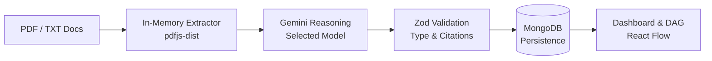

# ContradictionX — AI Requirements Intelligence

> **Detect software requirement conflicts, ambiguities, missing logic, and dependencies before engineering begins.**

[](https://nodejs.org/)
[](https://react.dev/)
[](https://vitejs.dev/)
[](https://expressjs.com/)
[](https://www.mongodb.com/)
[](https://ai.google.dev/)
[](LICENSE)

---

## 🚀 Live Demo

| Resource | Link |
|---|---|
| 🌐 **Live Application** | [https://contradiction-x.vercel.app/](https://contradiction-x.vercel.app/) |
| ⚙️ **Backend API** | [https://contradictionx.onrender.com](https://contradictionx.onrender.com) |

---

## Overview

ContradictionX is an AI-powered requirements intelligence platform that analyzes software specifications, regulatory policies, architecture documents, and product requirements documents (PRDs). It extracts atomic requirements from uploaded documents and uses Google Gemini to detect cross-document contradictions, ambiguous phrasing, missing edge-case specifications, and prerequisite dependency chains.

This is **not** a generic PDF chatbot or document summarizer. ContradictionX acts as an automated static analyzer for natural language requirements, producing cited evidence, severity ratings, confidence scores, suggested clarifications, and an interactive requirement topology graph.

---

## Problem

- **Silent Requirement Conflicts**: Teams author PRDs, security policies, and compliance specs in silos, causing conflicting rules to slip into production unnoticed.
- **Subjective Ambiguities**: Vague statements like *"the system must respond quickly"* lead to engineering misalignment and untestable implementations.
- **Missing Edge Cases**: Omitted session timeouts, boundary constraints, and error-handling specs trigger late-stage redesigns and vulnerabilities.
- **Tedious Manual Reviews**: Cross-referencing dozens of requirement pages across multiple documents is slow, inconsistent, and error-prone.

---

## Solution

1. **Ingest & Extract**: Upload multiple PDF and TXT requirement files simultaneously. In-memory extraction preserves page numbers and section attribution.
2. **Deconstruct**: Normalizes documents into discrete, atomic requirement units (`REQ-001`, `REQ-002`).
3. **Analyze with Gemini**: Evaluates cross-document consistency using structured JSON prompts and low temperature for determinism.
4. **Validate Runtime Schemas**: Validates every AI finding through Zod schemas to guarantee referential integrity and type safety.
5. **Review & Harmonize**: Delivers side-by-side evidence, impact summaries, suggested rewrites, and an interactive directed acyclic graph (DAG).

---

## ✨ Key Features

- **Multi-Document Analysis**: Ingest and compare up to 10 PDF and TXT files (up to 15MB each) in a single batch.
- **Contradiction Detection**: Surfaces direct logical and business rule conflicts across documents with cited side-by-side evidence.
- **Ambiguity Detection**: Highlights subjective or unverifiable terms and proposes measurable criteria.
- **Missing Information Detection**: Identifies omitted constraints, timeouts, error states, and permissions.
- **Dependency Detection**: Maps directional prerequisite and workflow relationships between requirements.
- **Evidence & Source References**: Every issue links to exact requirement IDs, document names, and page numbers.
- **Severity & Confidence**: Categorizes issues by severity (`high`, `medium`, `low`) and numerical confidence ratings ($0.0 \text{ to } 1.0$).
- **Interactive Dependency Graph**: Visualizes requirement prerequisite relationships as directed graphs using `@xyflow/react`.
- **Analysis History**: View, inspect, and delete previous intelligence reports saved in MongoDB.
- **Gemini Model Selection**: Choose between 5 supported Gemini models directly from the upload interface.
- **Custom Gemini API Key**: Optionally supply a custom Gemini API key for one-off analyses (ephemeral; never saved to disk, database, or browser storage).
- **Real-Time Progress**: Live Server-Sent Events (SSE) stream upload, extraction, reasoning, and saving stages to the UI.

---

## 🔄 How It Works



---

## 🛠️ Tech Stack

| Layer | Technologies |
|---|---|
| **Frontend** | React 19, Vite, React Router, Lucide Icons, Vanilla CSS |
| **Backend** | Node.js, Express, Multer, pdfjs-dist, Zod, Helmet, Morgan |
| **AI** | Google Gemini API (`@google/generative-ai`) |
| **Database** | MongoDB / MongoDB Atlas (Mongoose) |
| **Visualization** | `@xyflow/react` (React Flow) |
| **Deployment** | Vercel (Frontend), Render (Backend), MongoDB Atlas (Database) |

---

## 🤖 Gemini Model Selection

Users can choose which Gemini model processes their analysis from the upload interface. Requests are validated against a server-side allowlist (`backend/src/config/models.js`):

- `gemini-3.8-flash` (Default)
- `gemini-3.7-flash`
- `gemini-3.6-flash`
- `gemini-3.5-flash`
- `gemini-3.5-flash-lite`

*Note: Model availability, quotas, and rate limits depend on your Google Gemini API project tier.*

---

## 💡 Example

### Conflicting Requirements Across Documents

- **Document A (Privacy Policy)**: *"Upon confirmed deletion, the system must immediately purge all user records, transaction histories, and personal data within 60 seconds."*
- **Document B (Financial Compliance Spec)**: *"Under no circumstances may transaction history records, customer ledgers, or audit trails be deleted prior to the statutory seven-year retention window."*

**ContradictionX Detection**:
- **Type**: Contradiction (`high` severity, 0.94 confidence)
- **Impact**: Immediate deletion violates financial regulations, while retaining data without clarification risks GDPR non-compliance.
- **Suggested Clarification**: Scrub personal credentials and contact identifiers upon account deletion, while retaining anonymized transaction ledgers in a secure archive for the 7-year statutory period.

---

## 🚀 Getting Started

### Prerequisites
- Node.js (`>=18.0.0`)
- MongoDB (local instance or MongoDB Atlas URI)
- Google Gemini API Key ([Google AI Studio](https://aistudio.google.com/))

### 1. Clone & Install
```bash
git clone https://github.com/srirammulukuntla11/ContradictionX.git
cd ContradictionX

# Install backend dependencies
cd backend && npm install

# Install frontend dependencies
cd ../frontend && npm install
```

### 2. Configure Environment
Create `backend/.env`:
```env
PORT=5000
MONGODB_URI=mongodb://127.0.0.1:27017/contradictionx
GEMINI_API_KEY=your_gemini_api_key
GEMINI_MODEL=gemini-3.8-flash
CLIENT_URL=http://localhost:5173
NODE_ENV=development
```

### 3. Run Locally
In terminal 1 (backend):
```bash
cd backend
npm run dev
```

In terminal 2 (frontend):
```bash
cd frontend
npm run dev
```
Open `http://localhost:5173` in your browser.

---

## 🔐 Environment Variables

### Backend (`backend/.env`)
| Variable | Description | Example / Placeholder |
|---|---|---|
| `PORT` | Server listening port | `5000` |
| `MONGODB_URI` | MongoDB connection string | `mongodb://127.0.0.1:27017/contradictionx` |
| `GEMINI_API_KEY` | Google Gemini API key | `your_gemini_api_key` |
| `GEMINI_MODEL` | Default Gemini model | `gemini-3.8-flash` |
| `CLIENT_URL` | Allowed frontend origin for CORS | `http://localhost:5173` |
| `NODE_ENV` | Application environment | `development` |

### Frontend (`frontend/.env`)
| Variable | Description | Example / Placeholder |
|---|---|---|
| `VITE_API_BASE_URL` | Backend base URL (empty in dev to use Vite proxy) | `https://contradictionx.onrender.com/api` |

---

## ⚠️ Limitations

- **Text-Based Documents**: Supports digital PDFs with extractable text layers and plain text (`.txt`) files.
- **OCR Not Included**: Scanned image-only PDFs require OCR preprocessing before upload.
- **Human Review Required**: AI findings represent *potential* issues and should be reviewed by engineering and product teams before altering architecture.
- **Token & Quota Limits**: Very large document sets are subject to Google Gemini project quotas and rate limits.

---

## 🔮 Future Improvements

- OCR support for scanned PDF documents.
- Microsoft Word (`.docx`) and Markdown (`.md`) ingestion.
- Direct export of clarified requirements to Jira, Linear, and GitHub Issues.
- GitHub Actions integration to detect requirement conflicts in pull request diffs.

---

## 📄 License

This project is licensed under the [MIT License](LICENSE).

---

## 👨‍💻 Author

**Sriram Mulukuntla**

